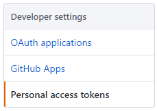
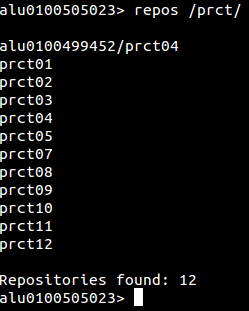
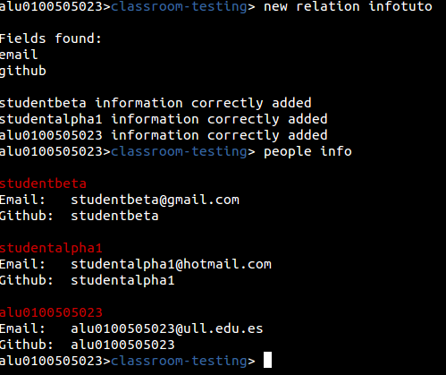
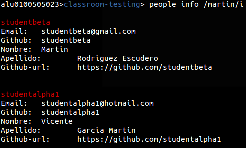
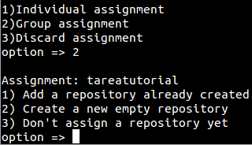
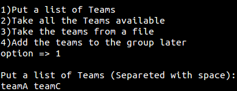
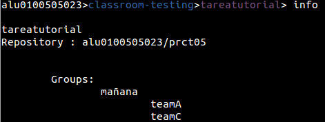
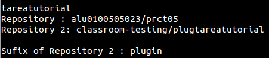

<div id="Marco1" dir="LTR"
style="position: absolute; top: 13cm; left: 0cm; width: 17cm; height: 3cm; border-top: 2.80pt solid #000000; border-bottom: 2.80pt solid #000000; border-left: none; border-right: none; padding: 0.15cm 0cm; background: #ffffff">

GitHub Education Shell

\
\

***Una Shell para el uso de GitHub en la Enseñanza***<span
style="font-style: normal"> **** </span>

*A Shell for the use of GitHub in Education*

\
\

\
\

Javier Clemente Rodríguez Gómez

\
\

</div>

<div id="Marco3" dir="LTR"
style="position: absolute; top: 0cm; left: 0cm; width: 17cm; height: 1cm; border: none; padding: 0cm; background: #ffffff">

La Laguna, 27 de enero de 2018

</div>

<div id="Marco2" dir="LTR"
style="position: absolute; top: 13.33cm; left: 2cm; width: 17cm; height: 1cm; border: none; padding: 0cm; background: #ffffff">

Grado en Ingeniería Informática

</div>

<div id="Marco6" dir="LTR"
style="position: absolute; top: 12.33cm; left: 2cm; width: 17cm; height: 1cm; border: none; padding: 0cm; background: #ffffff">

Trabajo de Fin de Grado

</div>

\
\

D. **Casiano Rodríguez León**, <span style="font-style: normal"><span
style="font-weight: normal">con N.I.F. 42.020.072-S profesor Catedrático
de Universidad adscrito al Departamento de Ingeniería Informática y de
Sistemas de la Universidad de La Laguna, como tutor</span></span>

\
\

\
\

\
\

\
\

**C E R T I F I C A (N)**

\
\

Que la presente memoria titulada:

“*GHEDSH: Una Shell para el uso de Github en la enseñanza”*

\
\

ha sido realizada bajo su dirección por D. **Javier Clemente Rodríguez
Gómez**,

con N.I.F. 78633504T.

\
\

Y para que así conste, en cumplimiento de la legislación vigente y a los
efectos oportunos firman la presente en La Laguna a 27 de enero de 2018

\
\

Agradecimientos

\
\

Casiano Rodríguez León

\
\

\
\

\
\

Licencia

\
\

\
\

\
© Esta obra está bajo una licencia de Creative Commons Reconocimiento
4.0 Internacional.

\
\

Resumen

Este proyecto trata de la elaboración de un programa en Ruby que permita
tanto el uso y manejo de datos de Github, como la asignación de tareas
por medio de repositorios en el entorno educacional haciendo uso de una
Shell. Para ello se seguirá la metodología de la plataforma GitHub
Education sobre el manejo de las Organizaciones como una clase para
profesor y sus alumnos.

\
\

\
\

**Palabras clave:** GitHub, GitHub Education, repositorios,
organizaciones, asignaciones, Shell, Ruby

\
\

\
\

Abstract

This project is about the elaboration of a program in Ruby that allows
both the use and handling of Github data, as well as the assignment of
tasks through repositories in the educational environment using a Shell.
This will be followed by the methodology of the GitHub Education
platform on the management of Organizations as a class for teachers and
their students.

\
\

**Keywords:** GitHub, GitHub Education, repositories, organizations,
assignments, Shell, Ruby

\
\

<div id="Índice de contenido1" dir="LTR">

<div id="Índice de contenido1_Head" dir="LTR">

**Índice general**

</div>

**[Capítulo 1 Introducción 1](#__RefHeading__459_1991373971)**

[1.1 ¿Que es GitHub Education? 1](#__RefHeading__461_1991373971)

[1.2 Antecedentes y situación actual 2](#__RefHeading__465_1991373971)

**[Capítulo 2 Objetivos y plan de trabajo
3](#__RefHeading__471_1991373971)**

[2.1 Objetivos 3](#__RefHeading__2475_63906294)

[2.2 Plan de trabajo 4](#__RefHeading__2477_63906294)

**[Capítulo 3 Desarrollo de la aplicación
5](#__RefHeading__475_1991373971)**

[3.1 Estudio sobre el funcionamiento de la API de GitHub
5](#__RefHeading__477_1991373971)

[3.1.1 Uso de la librería Octokit 6](#__RefHeading__3403_63906294)

[3.2 GitHub Education Shell 7](#__RefHeading__479_1991373971)

[3.2.1 Introducción y metodología 7](#__RefHeading__3405_63906294)

[3.2.2 Instalación 9](#__RefHeading__3407_63906294)

[3.2.3 Autentificación 11](#__RefHeading__3515_63906294)

[3.2.4 Ejecutando el programa por primera vez
13](#__RefHeading__3517_63906294)

[3.3 Problemas encontrados y soluciones
14](#__RefHeading__3431_63906294)

[3.3.1 Consultas y datos recibidos por la API
14](#__RefHeading__3433_63906294)

[3.3.2 La usabilidad en la navegación 14](#__RefHeading__3411_63906294)

**[Capítulo 4 Tutorial 15](#__RefHeading__2161_822559036)**

[4.1 Navegación y uso básico 15](#__RefHeading__3413_63906294)

[4.2 Organizando la clase 18](#__RefHeading__3415_63906294)

[4.3 Manejando asignaciones 23](#__RefHeading__3417_63906294)

**[Capítulo 5 Manual 28](#__RefHeading__483_1991373971)**

[5.1 Comandos globales 28](#__RefHeading__3419_63906294)

[5.2 Comandos a nivel de Repositorio 29](#__RefHeading__2469_1644639458)

[5.3 Comandos a nivel de Organización 30](#__RefHeading__3423_63906294)

[5.4 Comandos a nivel de Asignaciones 33](#__RefHeading__3425_63906294)

[5.5 Comandos a nivel de Equipo 34](#__RefHeading__3427_63906294)

[5.6 Comandos a nivel de Usuario 35](#__RefHeading__3429_63906294)

**[Capítulo 6 Conclusiones y líneas futuras
36](#__RefHeading__485_1991373971)**

**[Capítulo 7 Summary and Conclusions
37](#__RefHeading__487_1991373971)**

**[Capítulo 8 Presupuesto 38](#__RefHeading__489_1991373971)**

[8.1 Coste total 38](#__RefHeading__3471_63906294)

[8.2 Obtención de ingresos 38](#__RefHeading__3473_63906294)

**[Capítulo 9 Bibliografía 39](#__RefHeading__493_1991373971)**

</div>

\
\

<div id="Índice de ilustraciones1" dir="LTR"
style="background: transparent">

<div id="Índice de ilustraciones1_Head" dir="LTR">

**Índice de figuras**

</div>

\
\

ghed 1

ghclass 2

diagrama 7

oauth 11

oauth2 12

oauth3 12

tutorial 15

tutorial2 16

tutorial3 17

tutorial4 17

tutorial5 18

tutorial6 19

tutorial7 20

tutorial8 21

tutorial9 22

tutorial10 23

tutorial11 23

tutorial12 24

tutorial13 24

tutorial14 24

tutorial15 25

tutorial16 25

tutorial17 26

tutorial18 26

tutorial19 26

</div>

\
\

<div id="Índice de tablas1" dir="LTR">

<div id="Índice de tablas2_Head" dir="LTR">

**Índice de tablas**

</div>

Plan de trabajo 4

</div>

\
\

\
\

Capítulo 1 Introducción {.western style="page-break-before: always"}
=======================

1.1 ¿Que es GitHub Education? {.western}
-----------------------------

\
\

\
\

\
\

\
\

GitHub Education [[1]](#9.Bibliografía|outline) es una plataforma creada
por GitHub para difundir el uso y manejo de repositorios en el entorno
educacional. Además de proveer paquetes de herramientas de desarrollo
externas de manera gratuita, también ofrecen una metodología de trabajo
apoyada por aplicaciones web que hacen uso de su sistema.

Ellos proponen usar una organización de GitHub, una zona conjunta para
la asignación de proyectos en grupo, enfocada como si de una clase con
alumnos se tratase. La idea es que un profesor cree una organización y
luego añada a la misma alumnos para que posteriormente vaya asignándole
repositorios con diferentes tareas, para que pueda evaluarlas y hacer
feedback mediante las herramientas que ofrece GitHub.

A la hora llevar a cabo esta idea, GitHub posee los elementos que pueden
ser representados como el profesor, el alumno, o las tareas a realizar,
pero realmente no tienen un sistema de asignación específico para ello.
Por lo que su concepto de Asignación (o Assignment) debe ser manejado
por un sistema externo, que en este caso haga uso de su interfaz de
programación de aplicaciones (GitHub API).

\
\

\
\

1.2 Antecedentes y situación actual {.western}
-----------------------------------

\
\

Actualmente existen dos aplicaciones web que manejan o intentan usar
esta metodología planteada por GitHub Education.

\
\

Teacher's Pet [[2]](#9.Bibliografía|outline):

\
\

Se trata de una aplicación de línea de comandos que ejecuta consultas
hacia la API de GitHub. Ahora mismo esta en desuso, y además de no
proporcionar un entorno amigable al usuario, todo lo referente al
problema de las asignaciones no funciona correctamente.

\
\

GitHub Classroom
[[3]](#9.Bibliografía|outline):

\
\

\
\

Es la aplicación que recomienda la plataforma GitHub, actualmente en
uso. Se trata de una página web que conecta con el perfil de GitHub,
donde se permite el manejo y creación de asignaciones para los alumnos
registrados en una organización. Si bien soluciona parcialmente el
problema de la automatización, ofrece muy pocas opciones al usuario, y
se trata de un producto incompleto e inacabado.

\
\

Se ha visto que el desarrollo de ambas aplicaciones se encuentra
estancado o directamente abandonado, por lo que se propondrá una
alternativa en este trabajo de fin de grado. La idea será tomar lo mejor
de ambas aplicaciones, la comodidad del concepto del uso de consultas
para el usuario en una Shell, y la metodología de trabajo encontrada de
Education, mejor reflejada en la aplicación Classroom. Además de buscar
nuevas aplicaciones y utilidades que puedan mejorar la experiencia de
uso al usuario.

\
\

Capítulo 2 Objetivos y plan de trabajo {.western}
======================================

En este capítulo se detallarán los periodos de trabajo y los objetivos
presentes para este proyecto.

2.1 Objetivos {.western}
-------------

\
\

Los objetivos o actividades realizadas en este trabajo se definen a
continuación:

\
\

**A1.**<span style="font-weight: normal"> Analizar la plataforma GitHub
Education y su metodología.</span>

\

**A2.** Estudiar y analizar el funcionamiento de las aplicaciones ya
pertenecientes a GitHub Education: GitHub Classroom y Teacher's Pet.

\

**A3.** Estudiar sobre el enfoque de la aplicación a diseñar y las
tecnologías requeridas.

\

**A4.**<span style="font-weight: normal"> Estudiar cómo realizar la
aplicación y que funcionalidades se van a incluir en ella.</span>

\

**A5.** Crear una aplicación básica que permita al usuario
autentificarse y conectarse con su cuenta de GitHub, además de ejecutar
consultas simples.

\

\

**A6.** Ampliar el desarrollo de la aplicación para que pueda incluir la
estructura y funcionalidades necesarias para la metodología que propone
GitHub Education.

\
\

**A7.** Implementar el sistema automatizado de creación de Asignaciones
de tareas para los miembros de una clase.

\
\

**A8.** Añadir la posibilidad de importar y el manejo de datos de
alumnos para poder tener una información extendida de los miembros de
una clase.

\
\

**A9.** Creación de una gema para mejorar la usabilidad de la
aplicación.

\

\

**A10.** Mejorar la ayuda y crear un tutorial completo para facilitar al
usuario manejar de manera correcta la aplicación.

\

**2.2 Plan de trabajo** {.western style="margin-top: 0cm; margin-bottom: 0cm"}
-----------------------

\

  -------------- -----------------------
  **Objetivo**   **Fecha**
                 

  A1             5-10 Febrero
                 

  A2             10-15 Febrero
                 

  A3             15-20 Febrero
                 

  A4             20-25 Febrero
                 

  A5             25 Febrero - 15 Marzo
                 

  A6             15 Marzo - 10 Abril
                 

  A7             10-30 Abril
                 

  A8             1-10 Mayo
                 

  A9             10-30 Mayo
                 

  A10            1-20 Junio
                 
  -------------- -----------------------

\

\

\

Capítulo 3 Desarrollo de la aplicación {.western}
======================================

En este capítulo se presentará el proceso de desarrollo de la
aplicación, así como su modo de uso.

3.1 Estudio sobre el funcionamiento de la API de GitHub {.western}
-------------------------------------------------------

\
\

Para poder poder hacer uso de los datos de GitHub, así como modificarlos
y subirlos a su plataforma, se hará uso la interfaz de programación de
aplicaciones web “GitHub API v3” [[4]](#9.Bibliografía|outline).

Actualmente existen para esta API varias librerías que permiten el
intercambio de datos mediante peticiones HTTPS y envió de datos a través
del formato de texto ligero JSON.

Por un lado se puede encontrar la librería oficial <span
style="font-style: normal"><span style="font-weight: normal">Octokit,
que</span></span> **** <span style="font-weight: normal">tiene
diferentes versiones para distintos lenguajes de programación.</span>

Lenguajes en los que esta disponible Octokit:

-   Objetive-C

-   Ruby

-   .NET

Además de la oficial de GitHub, se pueden encontrar bastantes librerías
no oficiales en diferentes lenguajes tales como: Ruby, Python, Go, Java,
Haskell, Javascript, Julia, Pearl, Php o Ruby.

Finalmente, se optó por utilizar la librería oficial Octokit
[[5]](#9.Bibliografía|outline), para el lenguaje de programación Ruby.
Ya que ofrecía una mayor sensación de fiabilidad, estar mejor
documentada y haber sido usada también en la herramienta *Teacher's Pet*
diseñada por la propia plataforma GitHub.

\
\

### 3.1.1 Uso de la librería Octokit {.western}

- Autentificación compleja:

<span style="font-weight: normal">Se hace uso de ella al autenticar
completamente al usuario. Existen varias formas de aplicarla, como la
opción de Usuario y Contraseña que en este caso daría todos los permisos
existentes, o la autentificación por </span>*<span
style="font-weight: normal">Open Authorization</span>*<span
style="font-style: normal"><span style="font-weight: normal">
(</span></span><span style="font-style: normal">**Oauth**</span><span
style="font-style: normal"><span
style="font-weight: normal">)</span></span><span
style="font-style: normal"><span style="font-weight: normal">
</span></span>limitando los permisos aplicables a la aplicación.

\
\

A partir de aquí se podrán usar las diferentes opciones que ofrece la
librería. Que básicamente realizara consultas y convertirá los datos
recibidos en un tipo de objeto de una clase Ruby llamada *Sawyer*. Este
objeto creado contendrá volcada toda la información, que a su vez tendrá
que ser seleccionada para su uso por el propio programador que utilice
la herramienta.

3.2 GitHub Education Shell {.western align="LEFT"}
--------------------------

\
\

En este capítulo se explicaran tanto la metodología del programa, como
el proceso de instalación y autenficación.

### 3.2.1 Introducción y metodología {.western}

\
\

GHEDSH está diseñado para proveer diferentes funcionalidades dentro de
los distintos ámbitos pertenecientes a la plataforma GitHub.

Tanto el entorno de usuario, como las organizaciones, repositorios, o
equipos de trabajo, se verán reflejados en la aplicación. Y dado el caso
se podrán añadir, modificar o eliminar datos si fuese necesario.

\
Dada la necesidad de poder moverse con soltura entre los diferentes
marcos, se ha optado por simular el método de navegación en un árbol de
directorios dentro de una Shell.

\
\

\
\

El esquema refleja los diferentes ámbitos reflejados en el programa y el
orden de acceso de los mismos. El nivel de usuario está indicado como el
directorio raíz y los diferentes niveles serán subniveles del mismo.

Además, los elementos marcados en blanco reflejan su existencia real en
la plataforma GitHub. Por el contrario, los elementos marcados en rojos
serán elementos o ámbitos creados específicamente para el programa.

\
\

**Usuario**: El nivel de usuario actualmente logueado en la aplicación.

**Repositorios**: Dependiendo desde donde accedamos podremos situarnos
en un repositorio de un usuario, un repositorio de una organización, o
un repositorio de un equipo de trabajo de una organización.

**Organización**: El espacio de trabajo conjunto que provee GitHub. Será
donde se trabajen las aplicaciones enfocadas a GitHub Education.

**Equipos**: Equipos de trabajo entre varios usuarios de GitHub
registrados en una organización.

**Grupos de trabajo**: Concepto nuevo creado para la aplicación, que
agrupa varios equipos de trabajo en uno o varios grupos.

**Asignaciones**: Ámbito creado para el uso de la metodología de GitHub
Education. Abarcara la tarea creada, donde se guardara la relación de
repositorios a los grupos de trabajo o a usuarios de forma individual.

**Información extendida**: Información extendida de los usuarios
pertenecientes a una organización. Será importada al programa y
accesible desde la organización donde fuese añadida.

El programa permitirá moverse así, a varios niveles donde se podrán
ejecutar los métodos pertenecientes al ámbito donde este situado el
usuario. Por ejemplo:

\
\

\
\

Usuario \>

El usuario podrá ejecutar comandos a nivel de usuario.

\
\

Usuario \> Repositorio

El Usuario podrá ejecutar acciones a nivel del repositorio de usuario.

\
\

Usuario \> Organización

Se ejecutaran comandos a nivel de la organización.

\
\

Esto sucederá con los diferentes niveles representados en el esquema.

\
\

### 3.2.2 Instalación {.western}

\
\

**Instalación de Ruby**

Para poder ejecutar el programa es necesario tener instalado Ruby,
siendo necesario una versión igual a superior a la 1.9.3.

Para ello podemos ir a la terminal en sistemas como Debian o Ubuntu y
aplicar el siguiente comando:

``` {.western style="font-weight: normal"}
sudo apt-get install ruby-full
```

\
\

En sistemas como CentOS o Fedora lo podremos hacer con:

``` {.western style="font-weight: normal"}
sudo yum install ruby
```

\
\

En OS -X se puede instalar mediante:

``` {.western style="font-weight: normal"}
brew install ruby
```

\
\

Además de ser posible la instalación mediante cualquier gestor de
paquetes que provea el instalador de Ruby.

\
\

\
\

**Instalación de GHEDSH**

La instalación del programa se realiza de manera sencilla, ya que se ha
generado una Gema en RubyGem y solo es necesario instalarla en la
terminal de tu sistema.

Con este comando podrá ser instalado el programa en la carpeta que el
usuario prefiera, y donde deberá ser ejecutado a partir de ese momento.

*gem install ghedsh*

\
\

Al instalar el programa se creara una carpeta en el perfil de usuario
llamada **.ghedsh**. En ella se guardaran los diferentes archivos
necesarios para el guardado de datos, o la caché que se hará uso en la
aplicación.

\
\

Los diferentes archivos creados en el sistema serán:

*.ghedsh-users.json*

Contendrá los diferentes datos de los usuarios guardados en la
aplicación. Se usara para el Loguin de varios usuarios en el programa.

\
\

*.ghedsh-people.json*

Guardara la información extendida de las clases / organizaciones,
añadidas por el usuario.

\
\

*.ghedsh-clonedfiles*

Contendrá la información de los repositorios clonados.

\
\

*.ghedsh-cache.json*

Archivo usado para la caché y el guardado del path del usuario.

\
\

*groups.json*

Contendrá los grupos de equipos de trabajos guardados para cada clase /
organización.

\
\

*assignments.json*

Contendrá la información de las asignaciones creadas en la aplicación.

\
\

*ghedsh-”usuario”-history*

Archivo de guardado del historial de la línea de comandos de un usuario
específico del programa.

\
\

### 3.2.3 Autentificación {.western}

Para el acceso a GitHub mediante Octokit se ha optado por el método de
OAuth 2.0 y el uso de un Token portador.

Para el funcionamiento correcto entre el programa y la API,
necesitaremos crear un Token de acceso en GitHub que de los permisos
necesarios para la ejecución correcta de GHEDSH.

Para ello deberemos ir [https://github.com](http://github.com/) y
teniendo una cuenta ya creada, ir a la parte superior del menú y pinchar
en la pestaña del usuario. Ahí buscaremos la opción Settings y
entraremos en ella.

\
\
\

\
\

Después hace falta ir hasta la parte inferior donde se encuentran las
opciones de desarrolladores, y pulsar la opción *Personal access token*.
En esta pestaña pulsaremos a *Generate New Token.*

\
\

\
\
\

\
\

\
\

Nos aparecerá un cuadro con multitud de casillas de verificación a
rellenar, además de un cuadro de texto donde le pondremos nombre al
Token.

Las opciones a rellenar serán las representadas en la siguiente imagen.

\
\
\

Ya teniendo el Token creado podremos utilizarlo para autenticarnos en el
programa. Una vez hecho no hará falta volver a preocuparnos del Token ya
que se guardara en el perfil de usuario de la aplicación.

\
\

### 3.2.4 Ejecutando el programa por primera vez {.western}

Para ejecutar el programa debemos ir a la ruta donde se instaló el
programa y ejecutar el siguiente comando:

*ghedsh*

\
\

Para ver todas las opciones de ejecución de la aplicación usaríamos:

*ghedsh -h*

\
\

Al ejecutarse por primera vez, la aplicación pedirá el Token previamente
creado. Tras introducirlo se procederá al proceso de logueo y GHEDSH ya
estará listo para su uso.

Es posible directamente ejecutar el programa pasando por parámetro el
Token.

*ghedsh -t TOKEN*

\
\

Esto es debido a que se aceptan varios usuarios, y al añadir un nuevo
Token mediante esta opción, estaríamos directamente creando un nuevo
usuario y guardándolo en el perfil de usuario.

Para poder cambiar de usuario deberíamos usar el método de ejecución:

*ghedsh -u USUARIO*

\
\

Que cambiaría el usuario si este existiese y se hubiese logueado
correcta y anteriormente en la aplicación.

\
\

\
\

\
\

3.3 Problemas encontrados y soluciones {.western}
--------------------------------------

\
\

### 3.3.1 Consultas y datos recibidos por la API {.western}

La ejecución de las consultas a veces mostraba cierta inconsistencia a
la hora de devolver los resultados, sobretodo cuando no se encontraban
datos que retornar. Por lo que era posible que en consultas similares se
enviaran datos “vacíos”, o la API retornara fallo y por consecuencia
parase la ejecución del programa.

Esto hizo que tuviese que hacer uso del manejo excepciones en cada
consulta que no retornase datos, a base de probar y decidir que consulta
necesitaba especial atención.

\
\

### 3.3.2 La usabilidad en la navegación {.western}

\
\

Las primeras versiones si bien siendo funcionales, demostraban que el
manejo de la aplicación no era del todo cómodo para el usuario. Al tener
a veces tantos datos que manejar, y tantas utilidades que usar en
diferentes ámbitos, hacia que de primeras no fuese tan accesible al
usuario la navegación y uso de GHEDSH.

Para mejorar esta situación se tomaron varias medidas. Se añadieron
opciones de autocompletar de tanto los comandos como los datos volcados
desde la API, se creó un historial no solo para la sesión actual sino
también funcional cuando se volviese a ejecutar el programa, el guardado
de la posición del último nivel al regresar a la aplicación, la creación
de varios perfiles de usuario poder usar el programa en varias cuentas,
etc.

Todas estas medidas han hecho más natural y cómoda la navegación,
mejorando la usabilidad y eliminando el problema encontrado.

**Capítulo 4 Tutorial** {.western style="font-style: normal"}
=======================

4.1 Navegación y uso básico {.western}
---------------------------

Tras ejecutar el programa por primera vez, no encontraremos en el nivel
de usuario.

Lo primero que haremos es buscar nuestros repositorios, para eso
usaremos el comando:

*repos*

Al ejecutarlo se listaran todos los repositorios pertenecientes al
usuario, los que él sea colaborador, o los pertenecientes a una
organización en la que pertenezca. Si el usuario tiene mucha actividad
en la plataforma la lista de repositorios podría ser bastante extensa,
por lo que existe una opción de búsqueda por expresión regular para
agilizar el trabajo.

\
\

*repos /RegExp/*

\
\

\
\

\
\

\
\

\
\

\
\

\
\

<span style="font-weight: normal">En este caso he buscado repositorios
que contengan </span>*<span style="font-weight: normal">prct. </span>*

El siguiente paso será acceder a un repositorio. Para ello usaremos el
comando *cd*. La sintaxis será similar a la que suele emplear en una
terminal.

*cd [ruta]*

Siendo posible ampliar la búsqueda a varios ámbitos usando.

*cd [ruta1]/[ruta2]*

\
\

Volver atrás hacia un directorio padre:

*cd ..*

\
\

O mezclar ambos tipos de parámetros para realizar una operación más
compleja.

*cd ../../[ruta1]/[ruta2]*

\
\

\
\

\
\

\
\

\
\

Usando el comando nos situaremos en un repositorio cualquiera, en este
caso *pract05.*

Los comandos y funcionamiento de los mismos varían según el ámbito de
trabajo, por lo que el uso del comando *help* facilitara mucho la labor
al usuario.

Usando tan solo el comando mostrara los diferentes comandos disponibles
solo en ese nivel. Además de los comandos principales que están
disponibles en toda la aplicación.

\
\

Es posible dar por parámetro a la opción nombres de comandos para que
muestre específicamente la ayuda sobre ello.

*Help [comando]*

\
\

\
\

En este caso se ha buscado la ayuda contextual de las issues en un
repositorio. Mostrando tanto los comandos de creación de issues, enseñar
un issue, crear comentarios en issues y reabrir o cerrar un issue
específico.

Vamos a dejar este repositorio y volver al directorio raíz del usuario.
Ahí listaremos las Organizaciones donde estemos afiliados mediante el
comando.

*Orgs*

Seleccionaremos una y entraremos a ella mediante cd. A veces el nombre
de las organizaciones o repositorios son bastante complejos, por lo que
al listar las mismas se crea una opción de autocompletar en la línea de
comandos que activaremos con la tecla tabulador del teclado.

\
\

\
\

\
\

\
\

\
\

\
\

En el caso de este tutorial se entrara en una organización especialmente
para creada para ello. Si ejecutamos de nuevo *help* podremos ver que
las opciones han cambiado si lo comparamos con cualquier otro nivel de
trabajo.

Si quisiésemos ir a otra organización sin tener que ir paso por paso.
Podríamos hacer uso de la mezcla de parámetros comentada anteriormente.
En este caso ejecutando *cd ../TEC-INFO-GROUP* nos llevaría a esa
localización.

\
\

4.2 Organizando la clase {.western}
------------------------

Siguiendo la metodología de GitHub Classroom, a partir de ahora
trataremos a nuestra organización como una clase.

Y lo primero será buscar nuestros alumnos. Para ello usaremos el
siguiente comando:

*people*

\
\

\
\

\
\

\
\

\
\

Como vemos, se mostraran los identificadores de GitHub de cada alumno,
lo cual a veces es un problema para reconocerlos sobretodo si la clase
tiene muchos alumnos.

Para resolver este problema se ha implementado un sistema de información
extendida. Básicamente importaremos datos de los alumnos y los
guardaremos en el sistema, en cada clase donde estén asignados. Para
ello usaremos un sistema de carga de archivos en formato
*comma-separated-values* o csv.

El primer paso será obtener los emails de los alumnos, que serán
relacionados con sus identificadores de GitHub. Si trabajamos con
programas de docencia online como Moodle, podríamos crear una tarea para
que el alumno los publique y así poder exportarlos al archivos csv
posteriormente.

\
\

“mail”,”github”

“<studentbeta@gmail.com>”,”studentbeta”

“<studentalpha1@hotmail.com>”,”studentalpha1”

“<alu0100505023@ull.edu.es>”,”alu0100505023”

\
\

Este podría ser el ejemplo del contenido de ese archivo csv. Primero
colocaríamos los nombres de los campos en la primera línea, y en las
siguientes lineas iríamos poniendo la información de cada alumno.

Para la carga de esta relación entre GitHub y la información de los
alumnos, usaremos el comando *new relation.*

*New relation [archivo.csv]*

\
\

Hay que tener en cuenta que si el alumno no está registrado en la
organización, se descartara directamente toda la información que se vaya
a registrar de él.

\
\

Tras la inserción de datos podremos mostrar todos los datos agregados
con el comando *people info*.

Si queremos buscar los datos de un alumno en cuestión podremos usar la
Id de GitHub como parámetro o una expresión regular

*people info [Id de github]*

\
\

*people info /RegExp/*

\
\

\
\

\
\

\
\

\
\

\
\

\
\

\
\

\
\

Este tipo de búsqueda podrá ampliarse a los diferentes campos que
existan en la información adicional, no solamente al identificador de
usuario.

\
\

Este punto de la nueva relación se trata de un punto intermedio, ya que
para completar la información posteriormente se utilizara la utilidad
*new people info*.

*new people info [archivo csv]*

\
\

En el nuevo archivo csv colocaremos toda la información que queramos del
alumno. Teniendo en cuenta que en las cabeceras deberá haber alguno de
los dos campos que relacionen la información anteriormente guardada.
Debe estar o el campo ***email*** o el ***identificador de GitHub***.

\
\

\
\

\
\

Ejemplo de información extendida más completa.

\
\

“email”,”nombre”,”apellido”,”github-url”

"<studentbeta@gmail.com>”,"Martin","Rodriguez
Escudero","https://github.com/studentbeta"

“studentalpha1@hotmail.com”,"Vicente","Garcia
Martin","https://github.com/studentalpha1"

“alu0100505023@ull.edu.es”,"Javier","Rodriguez
Gomez","<https://github.com/alu0100505023>"

\
\

Esta información sería añadida a la ya posteriormente recopilada.

Este método está diseñado pensando en las dificultades que puede tener
un profesor de primeras para que todos los alumnos den sus datos o los
den de manera correcta. Se podría plantear una pequeña tarea a la clase
para que se den los datos necesarios para la relación, y más adelante
durante el curso ampliar con los datos completos.

Sin embargo, si se desea poner toda la información directamente desde la
primera vez, también es posible realizarlo mediante el comando *new
people info*, mientras en los datos se encuentren los campos de email y
github.

Después de haber subido la nueva información, podremos ejecutar
consultas como la búsqueda por nombre.

\
\



\
\

\
\

En este caso hemos buscado un alumno cuyo alguno de sus campos case con
“martin”. Revolviéndonos los datos añadidos del nuevo csv.

Como podemos ver en la información hemos guardado la página web de
GitHub de los alumnos. Esto hará que usando el comando open podamos
abrir en un navegador la pagina que deseamos ver.

*Open [ID de GitHub]*

Abrir la web del perfil GitHub del alumno, si se encuentra información
añadida.

*Open /RegExp/*

Abriría varios perfiles de GitbHub en el navegador por defecto. Por lo
que aplicando el ejemplo anterior.

\
\

*Open /Martin/*

Mostraría las webs de los alumnos que casen con esa expresión.

\
\

\
\

Es posible abrir diferentes tipos de páginas, no solo perfiles de
GitHub. Si por ejemplo queremos guardar el perfil de la plataforma
Moodle del alumno, podríamos abrir las direcciones tal que:

\
\

open [ID de GitHub] /Parte de la URL/

open /RegExp/ /Parte de la URL/

\
\

Por lo que ejecutando open /Rodriguez/i /moodle/ se abrirán las webs de
la plataforma *Moodle*, de los alumnos que casen con *Rodriguez*, si
estuviesen guardados esos datos.

\
\

\
\

\
\

4.3 Manejando asignaciones {.western}
--------------------------

Lo primero que debemos saber es que las tareas se podrán diferenciar
entre asignaciones individuales o asignaciones grupales.

¿Qué es un grupo? Un grupo de trabajo es una nueva categoría donde se
encontraran uno o varios equipos de trabajo.

Podemos crear manualmente el grupo mediante el comando *new group*, o
hacerlo mediante la creación de una tarea como se mostrara en el
tutorial.

\
\
\

Mediante el comando *groups* podremos ver la lista de los grupos
creados, donde se indicara el nombre del grupo, la lista de equipos y
los estudiantes que estén en ellos.

Para crear la asignación usaremos el comando *new assignment*, que
iniciara un asistente para la creación paso por paso de la tarea.

*new assignment [nombre de la asignación]*

\
\
\

\
\

En este caso se ha optado por una tarea grupal, y como vemos lo primero
que hace es pedirte un repositorio. Podemos asignarle un repositorio ya
creado, crear un nuevo repositorio en blanco junto con un archivo
*README.MD*, o no asignar nada por ahora.

\
\

\
\
\

El formato necesario será usuario y el nombre del repositorio, u
organización y el nombre de repositorio. En este caso usaremos el
repositorio *prct05* de la cuenta personal del usuario.

Tras añadirlo, como hemos seleccionado una opción grupal, nos preguntara
que grupos queremos añadir y aparecerá una lista de grupos ya creados
para seleccionar el que queramos. En este caso queremos hacer un nuevo
grupo, por lo que nos saltaremos este paso.

\
\
\

Al crear el nuevo grupo, añadiremos el nombre o podremos dejar que el
programa cree el grupo con un nombre que indique la fecha y hora de
creación.

De nuevo aparecerá una lista, esta vez siendo la lista de equipos para
decidir cuál será el paso a tomar ahora.

\
\

\
\
\

\
\

Podremos tanto escribir los equipos que deseamos, elegir todos los
equipos disponibles, cargar desde un archivo (Con formato línea a línea)
los equipos, o añadir posteriormente el o los equipos.

En este ejemplo se han añadido los equipos *teamA* y *teamC*, y con este
último paso se ha creado correctamente la estructura de la asignación.

Este asistente no creara aun la asignación de tareas, para ello debemos
ir hacia la propia asignación.

*cd [nombre de la asignación]*

Si se producirse redundancia entre nombres en la organización, podremos
usar el parámetro “assig” para ir directamente a la tarea.

*cd assig [nombre de la asignación]*

\
\

\
Si no recordamos el nombre de la tarea, solo tendremos que ejecutar el
comando assignments para que se muestre la lista de asignaciones.

\
\

Con comando *info* veremos toda la información de la asignación en la
que estemos situados. Dentro de este ámbito podremos añadir o modificar
los alumnos, grupos o repositorios que necesitemos.

\
\

En este caso Añadiremos un nuevo repositorio, en este caso en blanco, ya
que queremos que nuestros alumnos empiecen a trabajar de cero.

Para ello usaremos el comando *add repo*.

Tras ejecutarlo veremos de nuevo el mismo menú de repositorio del
asistente, donde elegiremos la opción que creamos conveniente.

\
\

Esta vez veremos un paso adicional, la petición para añadirle un sufijo
al repositorio. Esto será necesario cuando existan varios repositorios,
ya que a la hora de crear la tarea a cada grupo o alumno el programa
tomara como nombre el nombre de la asignación y el nombre del grupo o
alumno. Esto hará necesario un identificador para la creación de nuevos
repositorios. Los sufijos podrán ser modificados posteriormente mediante
*change sufix*

\
\
\

Por defecto el primer repositorio no tendrá un sufijo, pero si queremos
podremos asignarle uno si lo viésemos conveniente.

El último paso será la creación de la tarea, para ello usaremos el
comando *make* que creara toda la asignación de repositorios.

*Make*

Se ejecutara por parámetros y empezara el proceso de creación y
coronación de repositorios para el alumnado.

\
\
\

\
\

\
\

Si volvemos a la organización podremos comprobar que se han creado
correctamente los repositorios.

A partir de aquí se podrían usar diferentes utilidades del programa para
facilitar el análisis y la corrección de tareas. Tales como la creación
de Issues, la muestra de commits de un repositorio, etc.

\
\

Vamos por ejemplo a clonar los repositorios en nuestro sistema, para
ello podremos o seguir en la organización y usar una expresión regular
con el comando clone

*clone /RegExp/*

O volver a la tarea como haremos, y ejecutar clone sin parámetros para
que descargue automáticamente los repositorios.

\
\
\

Mediante el comando ! Podremos comprobar mediante un comando de bash,
que efectivamente se han clonado los repositorios en el directorio de
ejecución del programa.

*![comando de bash]*

Cuando acabemos de trabajar con los repositorios, podemos borrar el
contenido local mediante *rm clone files*.

\
\

*rm clone files*

Borraría todos los ficheros guardados en la lista de clonado de la
aplicación.

*rm clone files /RegExp/*

Borraría los repositorios indicados por el usuario.

\
\

\
\

Capítulo 5 Manual {.western}
=================

5.1 Comandos globales {.western}
---------------------

\
\

! Ejecuta un comando bash en GHEDSH

cd Te lleva al path indicado por parámetro.

*cd [path]* **

\
\

Para volver al directorio raíz lo ejecutamos sin parámetro.

*cd* **

Para volver al nivel anterior usaremos el parámetro “..”

*cd [..]*

\
\

Por defecto buscara un Repositorio al final de la cola de prioridades,
si quieres buscar un repositorio con mayor prioridad usaremos:

*cd repo [nombre]*

** Para buscar por defecto una asignación usaremos el parámetro “assig”.

*cd assig [nombre]*

\
\

do Ejecuta un script con comando GHEDSH desde un fichero.

*do [Fichero script]* **

exit Salir del programa.

help Lista de comandos disponibles.

rm clone files Borra los repositorios clonados con GHEDSH.

Puedes usar una expresión regular para borrar los repositorios que tú
prefieras.

*rm clone files /RegExp/*

**

5.2 Comandos a nivel de Repositorio {.western}
-----------------------------------

\
\

cat Muestra los datos de un fichero.

*cat [fichero]* **

\
\

clone Clona el actual repositorio.

close issue Abre un issue abierto.

** *close issue [Id del issue]* **

\
\

col Muestra la lista de colaboradores de un repositorio.

commits Muestra la lista de commits del repositorio.

Info Muestra información sobre el repositorio.

issue Muestra el issue y sus comentarios.

*issue [Id del issue]*

issues Muestra la lista de issues del repositorio.

files Muestra los ficheros del repositorio dado

new issue Crea un nuevo issue.

new issue comment Añade un comentario a un issue.

*new issue comment [Id del issue]* **

\
\

open Abre la web del repositorio de GitHub en el navegador por defecto.

open issue Abre un issue cerrado.

*open issue [Id del issue]*

\
\

private Cambia la privacidad de un repositorio. Espera “true” o “false”
como parámetro.

*private [true]*

\
\

5.3 Comandos a nivel de Organización {.western}
------------------------------------

\
\

assignments Muestra la lista de asignaciones.

clone Clona un repositorio.

clone [repositorio]

Puedes usar una expresión regular para clonar varios repositorios usando
el parámetro “/”.

*clone /[RegExp]/* **

\
\

group Muestra la información de un grupo específico.

** *group [nombre del grupo]* **

\
\

groups Muestra la lista de grupos y los equipos que pertenecen a ellos.

new assignment Crea una nueva asignación en tu organización.

*new assignment [nombre de la asignacion*]

\
\

new group Crear un nuevo grupo. Espera por parámetro el nombre y los
grupos dados uno a uno.

*new group [nombre del grupo] [team1] [team2] [team3] ...* **

Si quieres importar los equipos desde un archivo, usa el parámetro “-f”.

*new group -f [name of the group] [file]*

new people info Recoge la información extendida desde un archivo a .csv
encontrado en el path de ejecución.

*new people info [nombre del fichero]*

\
\

\
\

\
\

new relation Crea una relación para la información extendida entre la ID
de GitHub y un email desde un archivo .csv.

*new relation [nombre del fichero]* **

new repository Crea un nuevo repositorio en la organización.

** *new repository [nombre del repositorio]*

\
\

new team Crea un nuevo equipo en la organización. Espera el nombre del
equipo, y/o miembros dados uno por uno.

*new team [nombre del equipo] [member1] [member2] [member3] ...*

\
\

open Abre la URL de la organización de GitHub en tu navegador por
defecto.

Si se ha añadido información adicional, se puede abrir la web del perfil
de GitHub de un usuario pasándolo por parámetro.

*open [ID de GitHub]* **

Se puede usar una expresión regular para abrir varios usuarios.

*open /RegExp/*

Puedes abrir un campo específico si este contiene una URL.

*open [user] [Nombre del campo]* **

\
\

Si no se desea poner el campo, se puede hacer una búsqueda en los campos
con parte de la URL que se quiera abrir.

*open [user] /[parte de la URL]/* **

Cambien se puede usar una expresión regular para abrir varios usuarios a
la vez con ese tipo de búsqueda.

*open /RegExp/ /[part of the URL]/* **

\
\

people Muestra los miembros de la organización.

*people*

Si añades el parámetro “info”, se mostrara la información extendida.

*people info* **

\
\

Para encontrar a alguien específico en la información extendida, puedes
dar la ID de GitHub por parámetro.

*people info [github id]* **

\
\

Puedes usar una expresión regular que buscaría por cada campo, usando el
parámetro “/”.

*people info /[RegExp]/* **

\
\

repos Lista los repositorios de la organización.

Usa el parámetro “-a” para mostrar directamente la lista completa sin
interrupciones.

*repos -a*

\
\

Puedes usar una expresión regular para mejorar la búsqueda usando el
parámetro “/”

*repos /[RegExp]/* **

\
\

rm group Borra un grupo

*rm group [name of the group]*

rm people info Borra la información extendida de una clase.

rm repository Borra un repositorio en la organización.

*rm repository [nombre del repositorio]*

\
\

rm team Borra un equipo en la organización. Espera el nombre del equipo.

*rm team [nombre del equipo]*

\
\

teams Muestra los equipos de la organización.

\
\

5.4 Comandos a nivel de Asignaciones {.western}
------------------------------------

\
\

add group Añade un nuevo grupo a la asignación.

add repo Añade o crea un repositorio para la asignación.

add students Añade nuevos estudiantes a la asignación.

change repo Cambia un repositorio de la asignación.

*change repo [Numero del repositorio]*

\
\

change sufix Cambia el sufijo de un repositorio.

*change sufix [numero del repositorio]*

\
\

info Muestra la información de la asignación.

make Crea el o los repositorios de la asignación en GitHUb para cada
equipo de cada grupo o estudiante, dependiendo de las características de
la asignación.

\
\

open Abre la página en GitHub con la disposición de repositorios de la
asignación.

\
\

rm group Borra un grupo de la lista de la asignación.

*rm group [name]*

Para borrar todos los grupos de la lista, usaremos el parámetro “-all”.

*rm group -all*

\
\

rm repo Borra un repositorio de la lista de la asignación.

** *rm repo [id]*

rm student Borra un estudiante de la lista de la asignación.

*rm student [name]*

\
\

Para borrar toda la lista de estudiantes usaremos el parámetro “-all”.

*rm student -all*

\
\

5.5 Comandos a nivel de Equipo {.western}
------------------------------

\
\

add team member Añade un miembro a aun equipo.

*add team member [nuevo miembro]*

\
\

people Muestra los miembros del equipo.

open Abre la URL del equipo en GitHub.

\
\

repos Muestra los repositorios del equipo.

Usa el parámetro “-a” para mostrar directamente la lista completa sin
interrupciones.

*repos -a*

Puedes usar una expresión regular para mejorar la búsqueda usando el
parámetro “/”

*repos /[RegExp]/*

5.6 Comandos a nivel de Usuario {.western}
-------------------------------

\
\

clone Clona un repositorio.

clone [repositorio]

\
\

Puedes usar una expresión regular para clonar varios repositorios usando
el parámetro “/”.

*clone /[RegExp]/*

\
\

new repository Crea un repositorio en tu cuenta personal.

*new repository [nombre del repositorio]*

\
\

open Abre el perfil del usuario en la web de GitHub.

orgs Muestra las organizaciones del usuario.

\
\

repos Muestra tus repositorios.

Usa el parámetro “-a” para mostrar directamente la lista completa sin
interrupciones.

*repos -a*

\
\

Puedes usar una expresión regular para mejorar la búsqueda usando el
parámetro “/”

*repos /[RegExp]/*

rm repository Borra un repositorio del usuario.

*rm repository [nombre del repositorio]*

Capítulo 6 Conclusiones y líneas futuras {.western}
========================================

Si bien existen aplicaciones proporcionadas por GitHub, creo que mi
trabajo ha creado una buena alternativa dando más funcionalidades para
el usuario y buscando un nuevo enfoque de uso. Además, el hecho de haber
trabajado aprendiendo las necesidades reales de un profesor hace que en
cuestiones de utilidad, este por delante de las aplicaciones oficiales.

La creación de este proyecto me ha ayudado a tener más experiencia con
el uso y el manejo de las API, además de mejorar mis conocimientos de
Ruby. También me ha dado la oportunidad de desarrollar un programa
pensando en su instalación en otro sistema, algo de lo que carecía de
experiencia y ha supuesto una valiosa experiencia.

En mi plan de trabajo de futuro sobre la aplicación, pretendo añadir
nuevas utilidades, y además pensar en el uso del programa no solo desde
el enfoque del profesor, sino la posibilidad de uso del alumno. También
espero la posibilidad de poder actualizar datos entre este proyecto y
las demás herramientas oficiales, algo que en la actualidad no es
posible.

\
\

He de agradecer a mi tutor Casiano Rodríguez León, por ofrecerme la
oportunidad de crear este proyecto, además de por toda su ayuda dada. El
crear algo desde una necesidad y el pensar y buscar soluciones a un
problema, ha sido una de las razones por las que siempre he querido ser
informático. Por lo que personalmente haber realizado este proyecto me
ha resultado muy satisfactorio, y creo que ha sido la mejor manera de
terminar mi carrera y reafirmarme sobre mis futuros proyectos
profesionales.

\
\

Gracias a todos por leer esta memoria, espero que les haya gustado mi
trabajo.

Capítulo 7 Summary and Conclusions {.western}
==================================

<span lang="en-US"><span style="font-style: normal"><span
style="font-weight: normal">While aplications given for GitHub do exist,
I belive my work has created a good alternative, providing more
functionalities and a new perspective of usage</span></span></span><span
lang="en-US">. </span><span style="font-style: normal"><span
style="font-weight: normal">In</span></span><span lang="en-US"><span
style="font-style: normal"><span style="font-weight: normal"> addition,
to be able to work and learn simultaneously about the real necessities
of a teacher, adds more value to this project in comparison to the
official applications in matters of utility.</span></span></span><span
lang="en-US"> </span>

<span lang="en-US"><span style="font-style: normal"><span
style="font-weight: normal">The creation of this project has helped me
to earn more experience with the usage of the API system, and has also
improven my knowledge of Ruby.</span></span></span><span
lang="en-US"><span style="font-weight: normal"> </span></span><span
lang="en-US"><span style="font-style: normal"><span
style="font-weight: normal">It has also given me the opportunity to
develop a program bearing its installation in another system in mind,
and that was a valuable experience. </span></span></span>

<span lang="en-US"><span style="font-style: normal"><span
style="font-weight: normal">Regarding my future work about this
application, I pretend to add new utilities and revise the program usage
not only from a teacher's but also from a pupil's point of
view.</span></span></span><span lang="en-US"><span
style="font-weight: normal"> </span></span><span lang="en-US"><span
style="font-style: normal"><span style="font-weight: normal">I hope that
it will be possible to update data between this project and the official
applications, which cannot yet be done</span></span></span><span
lang="en-US">.</span>

<span style="font-style: normal"><span style="font-weight: normal">I
want to express my gratitude towards my tutor, Casiano Rodríguez León,
for giving me the oportunity to create this project, and for all his
help. </span></span><span style="font-style: normal"><span
style="font-weight: normal">To be able to create something out of a
necessity, and to think and look for solutions to concrete problems, has
been one of the main reasons I have always wanted to become a computer
engineer. Therefore, working on this project has been very satisfactory
for me, and I strongly believe that it was the best way to finish my
career while reafirming myself about my future profesional projects.
</span></span>

\
\

<span style="font-style: normal">Thank you for reading this memory. I
hope that you enjoyed my work.</span>

Capítulo 8 Presupuesto {.western}
======================

8.1 Coste total {.western}
---------------

Se han empleado unos seis meses de trabajo para desarrollar todo el
proyecto. Aplicando la media de sueldo en España para un desarrollador,
implicarían un gasto de 1600 euros al mes.

\

Esto haría unos 9600 euros en gastos de desarrollo y mano de obra. Todo
ello sin pensar en el futuro mantenimiento de la aplicación.

\

8.2 Obtención de ingresos {.western style="text-decoration: none"}
-------------------------

\

Una manera de obtener mayores ingresos con la aplicación podría ser el
ofrecer a los usuarios que quisiesen una versión con más utilidades, o
el desarrollo de nuevos métodos de manera especifica para algún usuario
o entidad de enseñanza que pueda ofrecer interés. Al ser una aplicación
de software libre, una versión “premium” sería publicitada por un precio
más bien simbólico, mientras que el desarrollo más específico y
personalizado tendría que verse sujeto a un análisis según los
requisitos del interesado.

\
\

Capítulo 9 Bibliografía {.western}
=======================

[[1](#1.1.¿Que%20es%20GitHub%20Education_|outline)] GitHub Education
<https://education.github.com/>

\
\

[[2](#1.2.Antecedentes%20y%20situación%20actual|outline)] Repositorio
Teacher's Pet

<https://github.com/education/teachers_pet>

\
\

<span style="font-weight: normal">[</span>[<span
style="font-weight: normal">3</span>](#1.2.Antecedentes%20y%20situación%20actual|outline)<span
style="font-weight: normal">] GitHub Classroom: </span>[<span
style="font-weight: normal">https://classroom.github.com/</span>](https://classroom.github.com/)

\
\

<span style="font-weight: normal">[</span>[<span
style="font-weight: normal">4</span>](#3.1.Estudio%20sobre%20el%20funcionamiento%20de%20la%20API%20de%20GitHub|outline)<span
style="font-weight: normal">] GitHub Developer web </span>[<span
style="font-weight: normal">https://developer.github.com/v3/</span>](https://developer.github.com/v3/)

\
\

[[5](#3.1.1.Uso%20de%20la%20librería%20Octokit|outline)] Octokit Api

[<span
style="font-weight: normal">https://www.rubydoc.info/github/pengwynn/octokit/Octokit</span>](https://www.rubydoc.info/github/pengwynn/octokit/Octokit)<span
style="font-weight: normal"> </span>

\
\

<span style="font-weight: normal">[6] Documentación Ruby </span>[<span
style="font-weight: normal">https://ruby-doc.org/core-1.9.3/</span>](https://ruby-doc.org/core-1.9.3/)

\
\

<span style="font-weight: normal">[7] Stackoverflow
</span><http://stackoverflow.com/><span style="font-weight: normal">
</span>

\
\

[8] Repositorio GHEDSH

<https://github.com/ULL-ESIT-GRADOII-TFG/ghedsh>

\
\

<https://rubygems.org/gems/ghedsh/versions/1.0.0>

