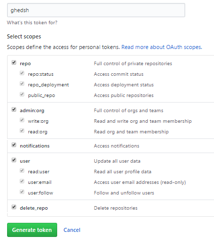

## GitHub Education Shell {#github-education-shell}

En este capítulo se explicaran tanto la metodología del programa, como el proceso de instalación y autenficación.

### Introducción y metodología {#introducci-n-y-metodolog-a}

GHEDSH está diseñado para proveer diferentes funcionalidades dentro de los distintos ámbitos pertenecientes a la plataforma GitHub.

Tanto el entorno de usuario, como las organizaciones, repositorios, o equipos de trabajo, se verán reflejados en la aplicación. Y dado el caso se podrán añadir, modificar o eliminar datos si fuese necesario.

Dada la necesidad de poder moverse con soltura entre los diferentes marcos, se ha optado por simular el método de navegación en un árbol de directorios dentro de una Shell.

El esquema refleja los diferentes ámbitos reflejados en el programa y el orden de acceso de los mismos. El nivel de usuario está indicado como el directorio raíz y los diferentes niveles serán subniveles del mismo.

Además, los elementos marcados en blanco reflejan su existencia real en la plataforma GitHub. Por el contrario, los elementos marcados en rojos serán elementos o ámbitos creados específicamente para el programa.

**Usuario**: El nivel de usuario actualmente logueado en la aplicación.

**Repositorios**: Dependiendo desde donde accedamos podremos situarnos en un repositorio de un usuario, un repositorio de una organización, o un repositorio de un equipo de trabajo de una organización.

**Organización**:El espacio de trabajo conjunto que provee GitHub. Será donde se trabajen las aplicaciones enfocadas a GitHub Education.

**Equipos**:Equipos de trabajo entre varios usuarios de GitHub registrados en una organización.

**Grupos de trabajo**:Concepto nuevo creado para la aplicación, que agrupa varios equipos de trabajo en uno o varios grupos.

**Asignaciones**:Ámbito creado para el uso de la metodología de GitHub Education. Abarcara la tarea creada, donde se guardara la relación de repositorios a los grupos de trabajo o a usuarios de forma individual.

**Información extendida**: Información extendida de los usuarios pertenecientes a una organización. Será importada al programa y accesible desde la organización donde fuese añadida.

El programa permitirá moverse así, a varios niveles donde se podrán ejecutar los métodos pertenecientes al ámbito donde este situado el usuario. Por ejemplo:

Usuario &gt;

El usuario podrá ejecutar comandos a nivel de usuario.

Usuario &gt; Repositorio

El Usuario podrá ejecutar acciones a nivel del repositorio de usuario.

Usuario &gt; Organización

Se ejecutaran comandos a nivel de la organización.

Esto sucederá con los diferentes niveles representados en el esquema.

### Instalación {#instalaci-n}

Instalación de Ruby

Para poder ejecutar el programa es necesario tener instalado Ruby, siendo necesario una versión igual a superior a la 1.9.3\.

Para ello podemos ir a la terminal en sistemas como Debian o Ubuntu y aplicar el siguiente comando:

_sudo apt-get install ruby-full_

En sistemas como CentOS o Fedora lo podremos hacer con:

_sudo yum install ruby_

En OS -X se puede instalar mediante:

_brew install ruby_

Además de ser posible la instalación mediante cualquier gestor de paquetes que provea el instalador de Ruby.

Instalación de GHEDSH

La instalación del programa se realiza de manera sencilla, ya que se ha generado una Gema en RubyGem y solo es necesario instalarla en la terminal de tu sistema.

Con este comando podrá ser instalado el programa en la carpeta que el usuario prefiera, y donde deberá ser ejecutado a partir de ese momento.

gem install ghedsh

Al instalar el programa se creara una carpeta en el perfil de usuario llamada **.ghedsh**. En ella se guardaran los diferentes archivos necesarios para el guardado de datos, o la caché que se hará uso en la aplicación.

Los diferentes archivos creados en el sistema serán:

.ghedsh-users.json

Contendrá los diferentes datos de los usuarios guardados en la aplicación. Se usara para el Loguin de varios usuarios en el programa.

.ghedsh-people.json

Guardara la información extendida de las clases / organizaciones, añadidas por el usuario.

.ghedsh-clonedfiles

Contendrá la información de los repositorios clonados.

.ghedsh-cache.json

Archivo usado para la caché y el guardado del path del usuario.

groups.json

Contendrá los grupos de equipos de trabajos guardados para cada clase / organización.

assignments.json

Contendrá la información de las asignaciones creadas en la aplicación.

ghedsh-”usuario”-history

Archivo de guardado del historial de la línea de comandos de un usuario específico del programa.

### Autentificación {#autentificaci-n}

Para el acceso a GitHub mediante Octokit se ha optado por el método de OAuth 2.0 y el uso de un Token portador.

Para el funcionamiento correcto entre el programa y la API, necesitaremos crear un Token de acceso en GitHub que de los permisos necesarios para la ejecución correcta de GHEDSH.

Para ello deberemos ir [https://github.com](http://github.com/) y teniendo una cuenta ya creada, ir a la parte superior del menú y pinchar en la pestaña del usuario. Ahí buscaremos la opción Settings y entraremos en ella.

Después hace falta ir hasta la parte inferior donde se encuentran las opciones de desarrolladores, y pulsar la opción _Personal access token_. En esta pestaña pulsaremos a _Generate New Token._

Nos aparecerá un cuadro con multitud de casillas de verificación a rellenar, además de un cuadro de texto donde le pondremos nombre al Token.

Las opciones a rellenar serán las representadas en la siguiente imagen.

Ya teniendo el Token creado podremos utilizarlo para autenticarnos en el programa. Una vez hecho no hará falta volver a preocuparnos del Token ya que se guardara en el perfil de usuario de la aplicación.

### Ejecutando el programa por primera vez {#ejecutando-el-programa-por-primera-vez}

Para ejecutar el programa debemos ir a la ruta donde se instaló el programa y ejecutar el siguiente comando:

ghedsh

Para ver todas las opciones de ejecución de la aplicación usaríamos:

ghedsh -h

Al ejecutarse por primera vez, la aplicación pedirá el Token previamente creado. Tras introducirlo se procederá al proceso de logueo y GHEDSH ya estará listo para su uso.

Es posible directamente ejecutar el programa pasando por parámetro el Token.

ghedsh -t TOKEN

Esto es debido a que se aceptan varios usuarios, y al añadir un nuevo Token mediante esta opción, estaríamos directamente creando un nuevo usuario y guardándolo en el perfil de usuario.

Para poder cambiar de usuario deberíamos usar el método de ejecución:

ghedsh -u USUARIO

Que cambiaría el usuario si este existiese y se hubiese logueado correcta y anteriormente en la aplicación.