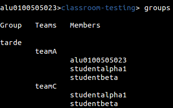
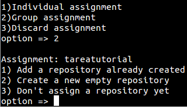
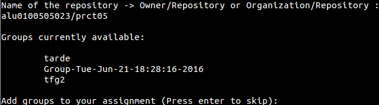
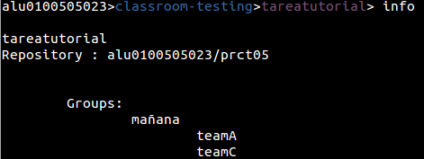
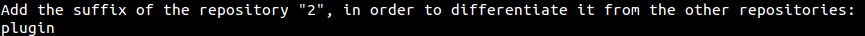
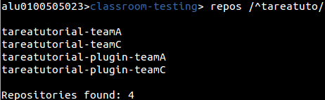
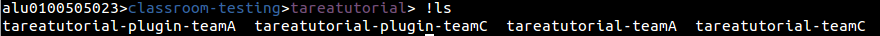

## Manejando asignaciones {#manejando-asignaciones}

Lo primero que debemos saber es que las tareas se podrán diferenciar entre asignaciones individuales o asignaciones grupales.

¿Qué es un grupo? Un grupo de trabajo es una nueva categoría donde se encontraran uno o varios equipos de trabajo.

Podemos crear manualmente el grupo mediante el comando _new group_, o hacerlo mediante la creación de una tarea como se mostrara en el tutorial.

Mediante el comando _groups_ podremos ver la lista de los grupos creados, donde se indicara el nombre del grupo, la lista de equipos y los estudiantes que estén en ellos.

Para crear la asignación usaremos el comando _new assignment_, que iniciara un asistente para la creación paso por paso de la tarea.

new assignment [nombre de la asignación]

En este caso se ha optado por una tarea grupal, y como vemos lo primero que hace es pedirte un repositorio. Podemos asignarle un repositorio ya creado, crear un nuevo repositorio en blanco junto con un archivo _README.MD_, o no asignar nada por ahora.

El formato necesario será usuario y el nombre del repositorio, u organización y el nombre de repositorio. En este caso usaremos el repositorio _prct05_ de la cuenta personal del usuario.

Tras añadirlo, como hemos seleccionado una opción grupal, nos preguntara que grupos queremos añadir y aparecerá una lista de grupos ya creados para seleccionar el que queramos. En este caso queremos hacer un nuevo grupo, por lo que nos saltaremos este paso.

Al crear el nuevo grupo, añadiremos el nombre o podremos dejar que el programa cree el grupo con un nombre que indique la fecha y hora de creación.

De nuevo aparecerá una lista, esta vez siendo la lista de equipos para decidir cuál será el paso a tomar ahora.

Podremos tanto escribir los equipos que deseamos, elegir todos los equipos disponibles, cargar desde un archivo (Con formato línea a línea) los equipos, o añadir posteriormente el o los equipos.

En este ejemplo se han añadido los equipos _teamA_ y _teamC_, y con este último paso se ha creado correctamente la estructura de la asignación.

Este asistente no creara aun la asignación de tareas, para ello debemos ir hacia la propia asignación.

cd [nombre de la asignación]

Si se producirse redundancia entre nombres en la organización, podremos usar el parámetro “assig” para ir directamente a la tarea.

cd assig [nombre de la asignación]

Si no recordamos el nombre de la tarea, solo tendremos que ejecutar el comando assignments para que se muestre la lista de asignaciones.

Con comando _info_ veremos toda la información de la asignación en la que estemos situados. Dentro de este ámbito podremos añadir o modificar los alumnos, grupos o repositorios que necesitemos.

En este caso Añadiremos un nuevo repositorio, en este caso en blanco, ya que queremos que nuestros alumnos empiecen a trabajar de cero.

Para ello usaremos el comando _add repo_.

Tras ejecutarlo veremos de nuevo el mismo menú de repositorio del asistente, donde elegiremos la opción que creamos conveniente.

Esta vez veremos un paso adicional, la petición para añadirle un sufijo al repositorio. Esto será necesario cuando existan varios repositorios, ya que a la hora de crear la tarea a cada grupo o alumno el programa tomara como nombre el nombre de la asignación y el nombre del grupo o alumno. Esto hará necesario un identificador para la creación de nuevos repositorios. Los sufijos podrán ser modificados posteriormente mediante _change sufix_

Por defecto el primer repositorio no tendrá un sufijo, pero si queremos podremos asignarle uno si lo viésemos conveniente.

El último paso será la creación de la tarea, para ello usaremos el comando _make_ que creara toda la asignación de repositorios.

Make

Se ejecutara por parámetros y empezara el proceso de creación y coronación de repositorios para el alumnado.

Si volvemos a la organización podremos comprobar que se han creado correctamente los repositorios.

A partir de aquí se podrían usar diferentes utilidades del programa para facilitar el análisis y la corrección de tareas. Tales como la creación de Issues, la muestra de commits de un repositorio, etc.

Vamos por ejemplo a clonar los repositorios en nuestro sistema, para ello podremos o seguir en la organización y usar una expresión regular con el comando clone

clone /RegExp/

O volver a la tarea como haremos, y ejecutar clone sin parámetros para que descargue automáticamente los repositorios.

Mediante el comando ! Podremos comprobar mediante un comando de bash, que efectivamente se han clonado los repositorios en el directorio de ejecución del programa.

![comando de bash]

Cuando acabemos de trabajar con los repositorios, podemos borrar el contenido local mediante _rm clone files_.

rm clone files

Borraría todos los ficheros guardados en la lista de clonado de la aplicación.

rm clone files /RegExp/

Borraría los repositorios indicados por el usuario.