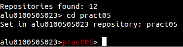
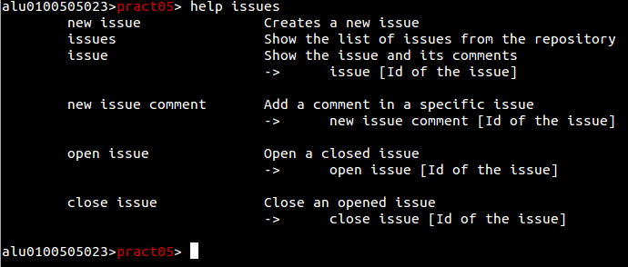

## Navegación y uso básico {#navegaci-n-y-uso-b-sico}

1.  

Tras ejecutar el programa por primera vez, no encontraremos en el nivel de usuario.

Lo primero que haremos es buscar nuestros repositorios, para eso usaremos el comando:

repos

Al ejecutarlo se listaran todos los repositorios pertenecientes al usuario, los que él sea colaborador, o los pertenecientes a una organización en la que pertenezca. Si el usuario tiene mucha actividad en la plataforma la lista de repositorios podría ser bastante extensa, por lo que existe una opción de búsqueda por expresión regular para agilizar el trabajo.

repos /RegExp/

En este caso he buscado repositorios que contengan _prct._

El siguiente paso será acceder a un repositorio. Para ello usaremos el comando _cd_. La sintaxis será similar a la que suele emplear en una terminal.

cd [ruta]

Siendo posible ampliar la búsqueda a varios ámbitos usando.

cd [ruta1]/[ruta2]

Volver atrás hacia un directorio padre:

cd ..

O mezclar ambos tipos de parámetros para realizar una operación más compleja.

cd ../../[ruta1]/[ruta2]

Usando el comando nos situaremos en un repositorio cualquiera, en este caso _pract05._

Los comandos y funcionamiento de los mismos varían según el ámbito de trabajo, por lo que el uso del comando _help_ facilitara mucho la labor al usuario.

Usando tan solo el comando mostrara los diferentes comandos disponibles solo en ese nivel. Además de los comandos principales que están disponibles en toda la aplicación.

Es posible dar por parámetro a la opción nombres de comandos para que muestre específicamente la ayuda sobre ello.

Help [comando]

En este caso se ha buscado la ayuda contextual de las issues en un repositorio. Mostrando tanto los comandos de creación de issues, enseñar un issue, crear comentarios en issues y reabrir o cerrar un issue específico.

Vamos a dejar este repositorio y volver al directorio raíz del usuario. Ahí listaremos las Organizaciones donde estemos afiliados mediante el comando.

Orgs

Seleccionaremos una y entraremos a ella mediante cd. A veces el nombre de las organizaciones o repositorios son bastante complejos, por lo que al listar las mismas se crea una opción de autocompletar en la línea de comandos que activaremos con la tecla tabulador del teclado.

En el caso de este tutorial se entrara en una organización especialmente para creada para ello. Si ejecutamos de nuevo _help_ podremos ver que las opciones han cambiado si lo comparamos con cualquier otro nivel de trabajo.

Si quisiésemos ir a otra organización sin tener que ir paso por paso. Podríamos hacer uso de la mezcla de parámetros comentada anteriormente. En este caso ejecutando _cd ../TEC-INFO-GROUP_ nos llevaría a esa localización.