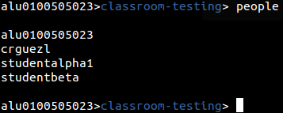

## Organizando la clase {#organizando-la-clase}

1.  

Siguiendo la metodología de GitHub Classroom, a partir de ahora trataremos a nuestra organización como una clase.

Y lo primero será buscar nuestros alumnos. Para ello usaremos el siguiente comando:

people

Como vemos, se mostraran los identificadores de GitHub de cada alumno, lo cual a veces es un problema para reconocerlos sobretodo si la clase tiene muchos alumnos.

Para resolver este problema se ha implementado un sistema de información extendida. Básicamente importaremos datos de los alumnos y los guardaremos en el sistema, en cada clase donde estén asignados. Para ello usaremos un sistema de carga de archivos en formato _comma-separated-values_ o csv.

El primer paso será obtener los emails de los alumnos, que serán relacionados con sus identificadores de GitHub. Si trabajamos con programas de docencia online como Moodle, podríamos crear una tarea para que el alumno los publique y así poder exportarlos al archivos csv posteriormente.

“mail”,”github”

“studentbeta@gmail.com”,”studentbeta”

“studentalpha1@hotmail.com”,”studentalpha1”

“alu0100505023@ull.edu.es”,”alu0100505023”

Este podría ser el ejemplo del contenido de ese archivo csv. Primero colocaríamos los nombres de los campos en la primera línea, y en las siguientes lineas iríamos poniendo la información de cada alumno.

Para la carga de esta relación entre GitHub y la información de los alumnos, usaremos el comando _new relation._

New relation [archivo.csv]

Hay que tener en cuenta que si el alumno no está registrado en la organización, se descartara directamente toda la información que se vaya a registrar de él.

Tras la inserción de datos podremos mostrar todos los datos agregados con el comando _people info_.

Si queremos buscar los datos de un alumno en cuestión podremos usar la Id de GitHub como parámetro o una expresión regular

people info [Id de github]

people info /RegExp/

Este tipo de búsqueda podrá ampliarse a los diferentes campos que existan en la información adicional, no solamente al identificador de usuario.

Este punto de la nueva relación se trata de un punto intermedio, ya que para completar la información posteriormente se utilizara la utilidad _new people info_.

new people info [archivo csv]

En el nuevo archivo csv colocaremos toda la información que queramos del alumno. Teniendo en cuenta que en las cabeceras deberá haber alguno de los dos campos que relacionen la información anteriormente guardada. Debe estar o el campo **_email_** o el **_identificador de GitHub_**.

Ejemplo de información extendida más completa.

“email”,”nombre”,”apellido”,”github-url”

&quot;studentbeta@gmail.com”,&quot;Martin&quot;,&quot;Rodriguez Escudero&quot;,&quot;https://github.com/studentbeta&quot;

“studentalpha1@hotmail.com”,&quot;Vicente&quot;,&quot;Garcia Martin&quot;,&quot;https://github.com/studentalpha1&quot;

“alu0100505023@ull.edu.es”,&quot;Javier&quot;,&quot;Rodriguez Gomez&quot;,&quot;[https://github.com/alu0100505023](https://github.com/alu0100505023)&quot;

Esta información sería añadida a la ya posteriormente recopilada.

Este método está diseñado pensando en las dificultades que puede tener un profesor de primeras para que todos los alumnos den sus datos o los den de manera correcta. Se podría plantear una pequeña tarea a la clase para que se den los datos necesarios para la relación, y más adelante durante el curso ampliar con los datos completos.

Sin embargo, si se desea poner toda la información directamente desde la primera vez, también es posible realizarlo mediante el comando _new people info_, mientras en los datos se encuentren los campos de email y github.

Después de haber subido la nueva información, podremos ejecutar consultas como la búsqueda por nombre.

En este caso hemos buscado un alumno cuyo alguno de sus campos case con “martin”. Revolviéndonos los datos añadidos del nuevo csv.

Como podemos ver en la información hemos guardado la página web de GitHub de los alumnos. Esto hará que usando el comando open podamos abrir en un navegador la pagina que deseamos ver.

Open [ID de GitHub]

Abrir la web del perfil GitHub del alumno, si se encuentra información añadida.

Open /RegExp/

Abriría varios perfiles de GitbHub en el navegador por defecto. Por lo que aplicando el ejemplo anterior.

Open /Martin/

Mostraría las webs de los alumnos que casen con esa expresión.

Es posible abrir diferentes tipos de páginas, no solo perfiles de GitHub. Si por ejemplo queremos guardar el perfil de la plataforma Moodle del alumno, podríamos abrir las direcciones tal que:

open [ID de GitHub] /Parte de la URL/

open /RegExp/ /Parte de la URL/

Por lo que ejecutando open /Rodriguez/i /moodle/ se abrirán las webs de la plataforma _Moodle_, de los alumnos que casen con _Rodriguez_, si estuviesen guardados esos datos.